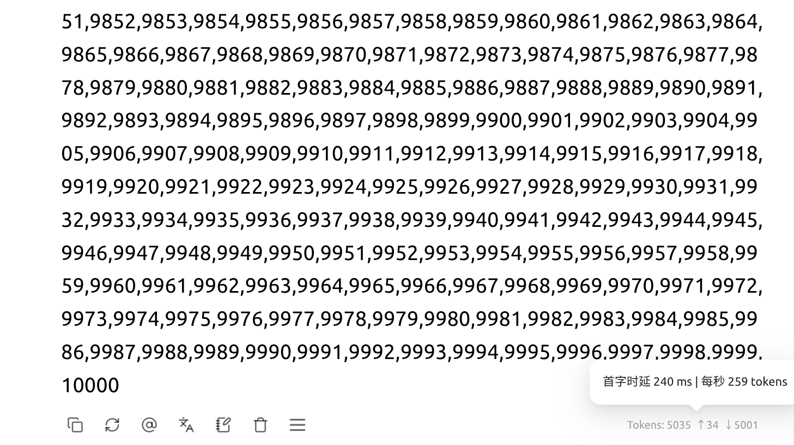

# Qwen-Flash-SM80 / CMP 170HX

[简体中文](README.md) | **English**

**A community vLLM runtime for Qwen3.8-Flash-Next on two SM80 GPUs.**

Uses **GDS direct SSD reads**, **TEP2 tensor and expert parallelism**, **MTP6 speculative decoding**, and specialized kernels to run the NVFP4 main model on two CMP 170HX GPUs. The approximately 51.2 GB PLE lookup table stays on SSD, with rows read into VRAM as needed.

**Historical benchmark (September 8, RadixArk checkpoint):** completed single-request long-output tests with **8K–128K input: 151.05–168.29 tok/s decode throughput**, all ending naturally. A separate short-prompt run before packaging recorded **170.826 tok/s**. The task instruction was **“写个网站网页”** (“Build a web page”) in all cases. **With shorter reasoning, output speed can reach approximately 200 tok/s.**

Validated hardware: **two CMP 170HX GPUs (SM80, approximately 63.39 GiB available VRAM each)**. The model and software versions are pinned; other SM80 devices and models have not been validated. Working GPU P2P and NVMe GDS are prerequisites; the container does not configure host drivers.

[Deployment guide](docs/DEPLOYMENT.en.md) · [Hardware and connectivity](docs/REFERENCE_HARDWARE.en.md) · [API connection](#api-connection) · [Integrated optimizations](#integrated-optimizations)

**v0.2.0:** the current runtime uses the **NVIDIA NVFP4 checkpoint**, with MTP6 + verified history drafts, lower host memory use, finer prefix matching, and small-message PCIe communication. Follow the [migration instructions](docs/DEPLOYMENT.en.md#upgrading-an-existing-deployment); old model data must not be mixed with the NVIDIA checkpoint. [Release validation](docs/RELEASE_VALIDATION.en.md).

Publication regression: **28 functional/context requests + 20 continuous conversation turns** passed, including approximately 260K input with follow-ups. This is bounded validation; see the report above.

## Project highlights

- **Direct SSD-to-GPU PLE reads:** GDS/cuFile reads the required lookup rows without staging the data payload in CPU memory, overlapping reads with model computation. Upstream already supports PLE offload to host RAM; this project adds an SSD-to-GPU path to the pinned upstream version.
- **Avoids approximately 47.68 GiB of full-table VRAM storage:** the **51.2 GB** FP8 PLE table stays on SSD, without keeping the entire table resident in VRAM or host RAM. GPUs retain the required data and working buffers. This figure is for one complete table, not a per-GPU saving.
- **From approximately 38 to 170.826 tok/s:** **4.50× the initial deployment's throughput, or roughly a 350% increase**. Code-heavy outputs have approached **200 tok/s**. These are results from different stages of the project, not a controlled comparison against stock vLLM.

## Historical 8K–128K benchmark

Task prompt: **“写个网站网页”** (“Build a web page”), preceded by web-design reference text to reach each input length. **Thinking enabled, using the template's default `xhigh` (highest supported level), without a separate thinking budget.** TEP2 + MTP6; output limit: 50,000 tokens. One run per length, all ending naturally. Both reasoning and answer tokens count toward output.

| Input length | Prefill throughput* (tok/s) | Decode throughput (tok/s) |
|---|---:|---:|
| 8K | 1986.38 | **168.29** |
| 16K | 2083.10 | **152.99** |
| 32K | 2068.85 | **156.44** |
| 64K | 2036.21 | **159.88** |
| 128K | 2059.93 | **151.05** |

**Outputs with less reasoning have approached 200 tok/s in testing (199 tok/s displayed by the client).**

*Prefill is a client-side approximation: input tokens divided by time to first nonempty output, including input processing and first-output generation. Decode is output tokens divided by the interval from the first to the last nonempty streamed output. It includes reasoning and answer text; empty events and the final completion notification do not extend this interval.

[Full prompt construction, sampling and timing details (Chinese)](docs/性能记录.md).

**By some people's misleading testing standards, it can reach 260 tokens/s.**

## Quick start

Follow the [deployment guide](docs/DEPLOYMENT.en.md): prepare the host → download and convert model data → build and start the service. Model deployment commands and settings are collected on that page. Model weights and prebuilt images are not included.

For CMP drivers, use the original community **bayley/cmpunlocker** project, which includes the BAR1/P2P patches. No additional patch bundle from this repository is needed. Hosts with working P2P/GDS can proceed directly to model preparation.

## API connection

| Client setting | Value |
|---|---|
| OpenAI-compatible base URL | `http://127.0.0.1:18420/v1` |
| Full chat-completions URL | `http://127.0.0.1:18420/v1/chat/completions` |
| Model | `qwen3.8-flash-next` |
| API key | Leave empty; use a placeholder if the client requires one |

Use the base URL or full endpoint as required by the client. The default service is accessible only from the host: `127.0.0.1` on a phone or another computer points to that device itself. See the [deployment guide](docs/DEPLOYMENT.en.md) for remote access, request examples, and troubleshooting.

## Integrated optimizations

| Area | Current implementation |
|---|---|
| SSD → GPU | GDS/cuFile PLE reads, C++ planning, 32 persistent readers, 3 reusable staging slots and ordered asynchronous handoff |
| Parallel execution | TEP2 (tensor parallelism + expert parallelism), Marlin and GPU P2P |
| Draft generation | MTP6 for new text; verified history matches propose 16 or 32 tokens. The configured capacity of 32 does **not** mean MTP32. |
| Draft scoring | Full-vocabulary INT8 screening, BF16 candidate reranking and an 8-candidate probability distribution used consistently by drafting and verification |
| Target scoring | Compact candidate communication with full-vocabulary fallbacks when required |
| Small compute shapes | HC GEMV, TileLang single-row projections, fused seven-row HC/GDN computation and CUDA Graph replay |
| Communication | FlashInfer PCIe IPC AllReduce for eligible BF16 `[1/7/33, 2560]` tensors; existing paths for other shapes |
| Multi-turn cache | Prefix matching in 36-token units; physical cache blocks remain 3,456 tokens |
| Host memory | Selective CUDA loading, targeted kernel preloading, streaming checkpoint preparation and memory limits |
| Stability | PLE handoff synchronization, context-boundary completion fixes and prewarmed sampling fallbacks |

The supported configuration is **two SM80 GPUs, one active request, synchronous scheduling**. Maximum combined context is 262,144 tokens; the configured output limit is also 262,144 and remains constrained by available context. Image input is configurable up to 128 images, but this is a limit rather than a claim that every 128-image request fits. Thinking, preserved reasoning history and tool parsing remain enabled by default.

Local measurements before packaging found approximately **1.51–1.91 ms less latency per MTP6 verification cycle** from the communication change. Acceptance rate and output content affect tokens/s; this is not a universal throughput gain. The historical table above is not a benchmark of the NVIDIA checkpoint or v0.2.0.

## Repository layout

- `src/`: runtime source overlay for the pinned upstream version, including GDS, HC, TileLang, and draft INT8.
- `csrc/`: C++ source for the GDS reader extensions, compiled during the image build.
- `src/preload/`, `src/memory_extra_preload/`: approximately 24 MB of preloaded Triton kernels and SHA256 manifests for this fixed SM80 environment; no model weights.
- `patches/`: upstream source hashes and provenance information to prevent overwriting incompatible versions.
- `config/`, `scripts/`: configuration examples, service control, data preparation, and build tools. CLI messages currently remain in Chinese.
- `docs/`: performance, deployment, and validation records. English deployment, CMP P2P, and NVMe GDS guides are available; detailed historical records remain in Chinese.

## Acknowledgments and license

Thanks to vLLM, Qwen, the original Qwen3.8-Flash-DGX community project, NVIDIA GDS, the cmpunlocker community, Marlin, Triton, TileLang, and their contributors. Existing source notices are preserved. Inference project code is licensed under Apache-2.0; model weights, CUDA/cuFile, containers, and third-party dependencies retain their respective licenses. See [LICENSE](LICENSE) and [source provenance and licensing details (Chinese)](docs/来源与许可.md).
