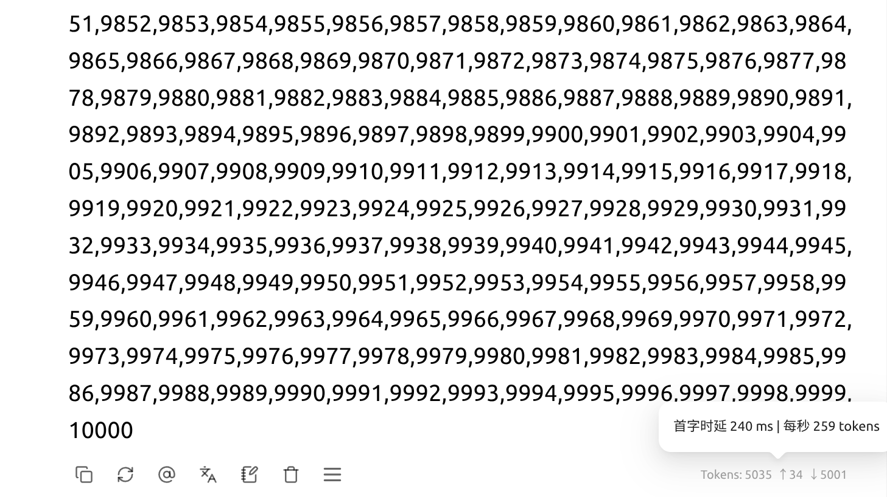

# Qwen-Flash-SM80 / CMP 170HX

**简体中文** | [English](README.en.md)

**面向双 SM80 显卡的 Qwen3.8-Flash-Next 社区 vLLM 运行方案。**

使用 **GDS 直读 SSD**、**TEP2 双卡并行**、**MTP6 推测生成**及专用内核，在双 CMP 170HX 上运行 NVFP4 主模型。约 51.2 GB 的 PLE 查表数据留在 SSD，按需读入显存。

已完成 **8K～128K 输入的单请求长输出测试，decode 速度为 151.05～168.29 tok/s**，均自然结束。打包前的短提示词长输出记录为 **170.826 tok/s**。任务提示词均为“写个网站网页”。**若思考较短，输出速度可达到约 200 tok/s。**

已验证硬件为 **双 CMP 170HX（SM80，每卡约 63.39 GiB 可用显存）**。本项目固定模型和软件版本；其他 SM80 设备及模型尚未验证。需先具备可用的 GPU P2P 与 NVMe GDS，容器不会自动配置主机驱动。

[开始部署](docs/从零部署.md) · [参考硬件与接线](docs/REFERENCE_HARDWARE.md) · [API 接入](#api-接入) · [已集成优化](#已集成优化)

## 项目特点

- **SSD 直通显卡**：通过 GDS/cuFile 按需读取 PLE 查表数据，数据本体无需经过 CPU 内存中转，并将读取与模型计算重叠。上游已有 PLE CPU 内存卸载；本项目在固定上游版本上增加了这条 SSD → GPU 直通路径。
- **减少约 47.68 GiB 的整表显存需求**：约 **51.2 GB** 的 FP8 PLE 表保存在 SSD，无需整表常驻显存，也无需整表常驻主机内存；显存只保留所需数据与工作缓冲区。容量按一整份表计算，不是每张卡各省 47.68 GiB。
- **从约 38 提升到 170.826 tok/s**：相当于初始部署的 **4.50 倍，吞吐量提升约 350%**；代码较多的实测场景可接近 **200 tok/s**。这是项目不同阶段的历史对比，并非同条件原版 vLLM 对照。[数据与说明](docs/性能记录.md)

## 8K～128K 测速

任务提示词：**“写个网站网页”**，前置网页设计参考资料填充输入长度。**开启思考，使用模板默认 xhigh（最高档），未单独限制思考预算**；TEP2＋MTP6，输出上限 50,000 token，每档一轮，均自然结束。思考内容与正文均计入输出。

| 输入长度 | Prefill 速度*（tok/s） | Decode 速度（tok/s） |
|---|---:|---:|
| 8K | 1986.38 | **168.29** |
| 16K | 2083.10 | **152.99** |
| 32K | 2068.85 | **156.44** |
| 64K | 2036.21 | **159.88** |
| 128K | 2059.93 | **151.05** |

**实测思考较少时，输出速度可接近 200 tok/s（客户端显示 199 tok/s）。**

*Prefill 为“输入 token 数 ÷ 首输出等待时间”的客户端近似值，包含输入处理和首输出生成等开销。Decode 按第一个至最后一个非空流式输出计时。[完整提示词构造、采样参数与计时口径](docs/性能记录.md)。

**按部分用户采用的连续数字输出测试方式，速度可达到约 260 tok/s。**

## 快速开始

按 [部署指南](docs/从零部署.md) 完成三个步骤：准备主机 → 下载并转换模型数据 → 构建并启动服务。模型部署命令和配置集中在该页；仓库不包含模型权重或预构建镜像。

CMP 驱动优先使用已包含 BAR1/P2P 补丁的原始社区项目 **bayley/cmpunlocker**，无需额外叠加本仓库补丁。已有 P2P/GDS 可用的主机可直接进入模型准备。

## API 接入

| 客户端设置 | 值 |
|---|---|
| OpenAI 兼容 Base URL | `http://127.0.0.1:18420/v1` |
| 完整聊天请求地址 | `http://127.0.0.1:18420/v1/chat/completions` |
| 模型名 | `qwen3.8-flash-next` |
| API Key | 留空；客户端强制要求时可填占位值 |

按客户端要求填写 Base URL 或完整地址，二者不要混用。默认仅允许本机访问：手机或另一台电脑上的 `127.0.0.1` 指向它自己。远程接入、请求示例及常见故障见 [部署指南](docs/从零部署.md)。

## 已集成优化

| 已采用的优化 | 实现 | 已有结果 |
|---|---|---|
| GDS＋PLE 接入 | 通过 cuFile 直接读取 PLE 数据至显存，接入输入准备与缓冲区生命周期 | 数据及生命周期验证通过；未单独测量整模型收益 |
| C++ 读取计划器 | 将读取任务规划移至 C++，减少 Python 对象构造 | 历史 4096 行规划约 8.655→1.188 ms，仅为局部耗时 |
| 常驻读取线程、固定缓冲区 | 复用线程、读取句柄与工作区 | 当前配置为 32 个读取线程、3 个缓冲槽位 |
| 同进程异步读取与交接修复 | 重叠 I/O 与模型计算，减少跨进程等待，修复输入过早复用 | 历史组合版本 51.33→66.74 tok/s，非单项独立收益 |
| TEP2 与 P2P 通信 | 组合张量并行与专家并行，使用双卡直接通信 | 早期 MTP6 各五轮汇总：TEP2 131.044、TP2 127.820 tok/s |
| HC 单行 GEMV | 为 HC 单行输入实现专用矩阵向量乘内核 | 当时 TP2 对照 74.55→80.02 tok/s |
| TileLang 输入投影 | 融合单行 QKVZ/BA 投影，复用原有输出缓冲区 | 已集成；未单独测量整模型收益 |
| CUDA Graph 与融合算子 | 复用计算图，减少内核提交开销 | 保留整体计算图与原有 MTP GDN 融合路径 |
| MTP6＋七行 PLE 行号规划 | 对多 token 验证使用 NumPy 行号规划快路径 | 整理版历史五轮汇总 131.044；行号规划版随后单次 158.013 tok/s |
| 全词表 INT8 草稿打分＋BF16 复核 | INT8 计算完整词表分数，每卡 top-32 候选使用 BF16 权重复核，再汇总最优候选 | 单次 170.826 tok/s；历史前版单次 158.013，观察差异约 +8.1% |
| 加载内存保护 | 限制容器内存，在主机可用内存低于阈值时停止受管服务 | 保留加载修复与内存保护；未计入 decode 收益 |

表中记录来自不同阶段和条件，**不能相加或相乘**。最新 INT8 与历史版本的输出内容不同，8.1% 是观察差异，尚不能据此确定量化的独立收益。[查看完整测试条件](docs/性能记录.md)。

## 仓库内容

- `src/`：相对固定上游的运行源码，包括 GDS、HC、TileLang 和草稿 INT8。
- `csrc/`：GDS 读取扩展的 C++ 源码；构建时生成本机扩展。
- `src/preload/`：该固定 SM80 环境使用的 Triton 预加载内核和 SHA256 清单，约 17 MB，不含模型权重。
- `patches/`：上游源码校验值与来源分类，防止误覆盖其他版本。
- `config/`、`scripts/`：配置示例、启动/停止、数据准备及构建入口。
- `docs/`：已采用优化、性能数据与使用范围。提供中英文首页、部署指南、P2P 与 GDS 参考文档；详细历史记录为中文。

## 致谢与许可

感谢 vLLM、Qwen 模型实现、原 Qwen3.8-Flash-DGX 社区项目，以及 NVIDIA GDS、cmpunlocker 社区、Marlin、Triton、TileLang 等项目。仓库保留引用源码的既有声明，推理项目代码采用 Apache-2.0；模型、CUDA/cuFile、容器与第三方依赖按各自许可证使用。详见[来源与许可](docs/来源与许可.md)。
